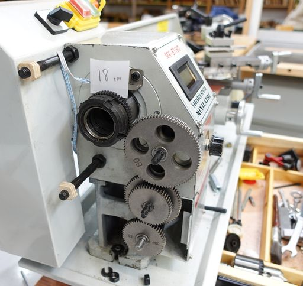

<html><head>

<title>Mini lathe abritrary thread gearing calculator</title>
</head>
<body>
<h1>Mini lathe abritrary thread gearing calculator</h1>

On cheap mini lathes, for threading different pitches of gears, rather than
having a gearbox with some gear selector, one has to place different gears
on posts on the lathe to gear reduce from the lathe's spindle onto the lead
screw that moves the carriage side to side.

With a number of gears included in the lathe, and five gears that can
be swapped for different gears, this opens up a <i>lot</i> of possibilities
for different gear ratios.

My Vevor mini lathe came with a table printed on the cover showing which
gears to place on which post to configure the lathe for common Metric
and Imperial thread pitches.  However, these listed gears that the lathe
did not come with.  So I set out to work out a combination for the pitch
I wanted that used gears that I have.  I made a spreadsheet that calculated
the gear ratios to try them out.  To ensure my calculations were correct,
I entered the provided threading table.  But my values disagreed.  After
much investigation, I realized the included threading table was 
very inaccurate, to the point of being practically useless for imperial
threads.
 
<h1>Trying all gear combinations</h1>

<iframe class="yt"src="https://youtube.com/embed/sYw7OfeC1b8" allowfullscreen></iframe>

To figure out what the <i>best</i> gears are for different pitches, I figured
its best to just try all gear combinations with a computer program.

And this is why I wrote the python script <b>lathe_thread_gears.py</b>

This is a python script that is run from the command line. 
Configuration for the script, such as which gears you have, metric or imperial, and
target thread pitches are parameters at the top of the script.  Modify
these values to configure it.  If your lathe has only four gears that you can swap,
you will have to modify the code in the script also.

Output from the program looks like this:
<pre>
Gear threading table, Lead screw gear first, gear engaging spindle last
'E=' indicates % error from target pitch value

 12.9352,  20,  Any,Any,   24, 66,  E=-0.498%
-------- 13 tpi --------
 13.0256,  72,   52, 40,  Any,Any,  E= 0.197%

 13.9700,  33,  Any,Any,   40, 72,  E=-0.214%
-------- 14 tpi --------
 14.1111,  80,   80, 60,  Any,Any,  E= 0.794%

 15.6790,  20,  Any,Any,   24, 80,  E=-2.006%
-------- 16 tpi --------
 16.1431,  66,  Any,Any,   50, 52,  E= 0.894%

 17.9103,  50,   52, 72,   60, 66,  E=-0.498%
-------- 18 tpi --------
 18.0912,  80,   52, 50,  Any,Any,  E= 0.507%

 19.9003,  50,   60, 80,   52, 66,  E=-0.498%
-------- 20 tpi --------
 20.0121,  60,   40, 52,   66, 72,  E= 0.061%

 23.8803,  66,   52, 80,  Any,Any,  E=-0.499%
-------- 24 tpi --------
 24.2147,  72,   40, 52,   60, 66,  E= 0.895%

 27.9400,  33,  Any,Any,   20, 72,  E=-0.214%
-------- 28 tpi --------
 28.2222,  80,  Any,Any,   40, 60,  E= 0.794%

 31.5773,  72,   52, 80,   33, 40,  E=-1.321%
-------- 32 tpi --------
 32.2385,  72,   40, 66,   52, 60,  E= 0.745%

Total gear combinations (including duplicates): 1876
Total gear ratios: 373
</pre>

The frist actual output line from above would be this:
<pre>12.9352,  20,  Any,Any,   24, 66,  E=-0.498%</pre>
This indicates:
<table cellpadding=5 border=1 cellspacing=0>
<tr><td>Actual pitch generated<td>12.9352<td>TPI
<tr><td>Gear on end of lead screw<td>20<td>teeth
<tr><td>Bottom movable post gears<td>Any,Any <td>Only one gear on this post, 
doesn't gear up or down so any tooth count will work.
<tr><td>Top movable post gears<td>24,66<td>24 tooth gear engages with gears below 
66 tooth gear engages with the spindle gear
<tr><td>Error<td>E=-0.498%<td>The pitch is 4.98% smaller than targeted.
</table>

The script prints the best combination it can find on either side
of the target gear ratios.  It omits gear combinations that:
<ul><li>Would cause interference between gears
<li>Would not reach the spindle
<li>Would not fit on the tiltable mounting bar
<li>would not allow the housing to be closed
</ul>
However, the checks are rudimentary so just because it passed a combination
as valid, doesn't guarantee that it will fit.  Your lathe may of course have
a different geometry from my Vevor mini lathe, so the criteria may need
adapting to your lathe.

The program is command line based and written in Python.  Some familiarity with
the command line and Python <i>are</i> necessary to use this script.
 

